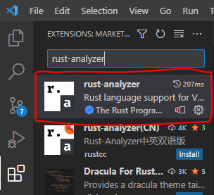

[中文](./README_cn.md)

# bevy-sandbox
A collection of projects written with Rust using Bevy game engine.

## Getting started

1. Install Rust (Using [rustup](https://rustup.rs/))

2. (Optional for Visual Studio Code users) Install rust-analyzer plugin and rust-src:

    ```console
    rustup component add rust-src
    ```

    And

    

3. Clone this repository:

    ```console
    git clone https://github.com/TogetherGame/bevy-sandbox.git
    cd bevy-sandbox
    ```

4. Install requirements:

    - (Linux) Install `gcc`.

    - (Linux) Install dev package of `alsa-lib`, such as `alsa-lib-devel` on RedHat.

    - (Linux) Install dev package of `libudev`, such as `systemd-devel` on RedHat, `libudev-dev` on Debian distros.

5. Since this project is a workspace, in order to run certain project, you have to
either `cd` into that project's directory then execute `cargo run` or run it inside the main directory as follows:

    ```console
    cargo run -p hello_world
    ```

    Or, this project provides a shorter alias `rp` which simply does the same thing, which allows running above command by simply entering:

    ```console
    cargo rp hello_world
    ```

    > The first compilation proccess might take a few minutes as cargo has to fetch the build requirement crates to build the entire engine.

## Contributing

1. Fork this repository (recommanded) or make a new branch

2. Clone the forked repository or the new branch

3. Make your modification

4. Format the code and test with clippy

    (Requires rustfmt and clippy, so if you don't already have them installed, run `rustup component add rustfmt clippy` to install)

    ```console
    cargo fmt --all
    cargo clippy --all
    ```

5. Commit & Push your modification

    ```console
    git add .
    git ci -a -m '<MASSAGE>'
    git push
    ```

6. Then open a new Pull Request with the fork/branch you have created.
